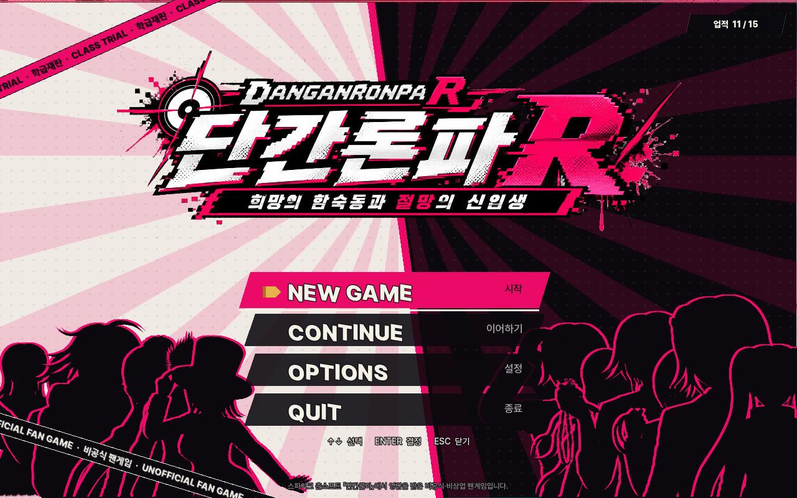
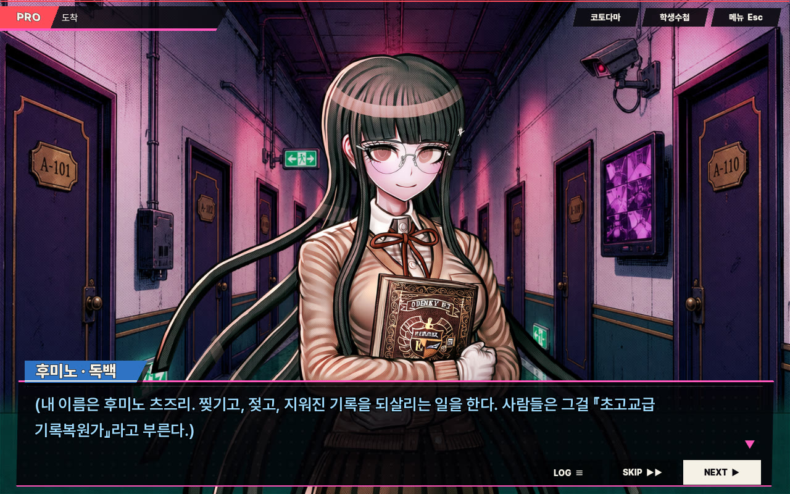
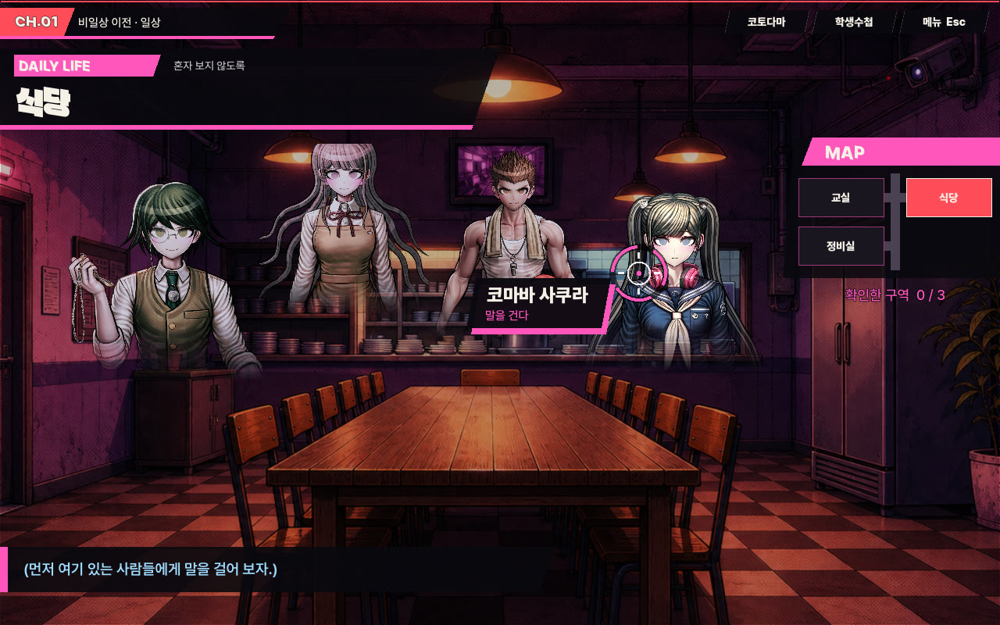
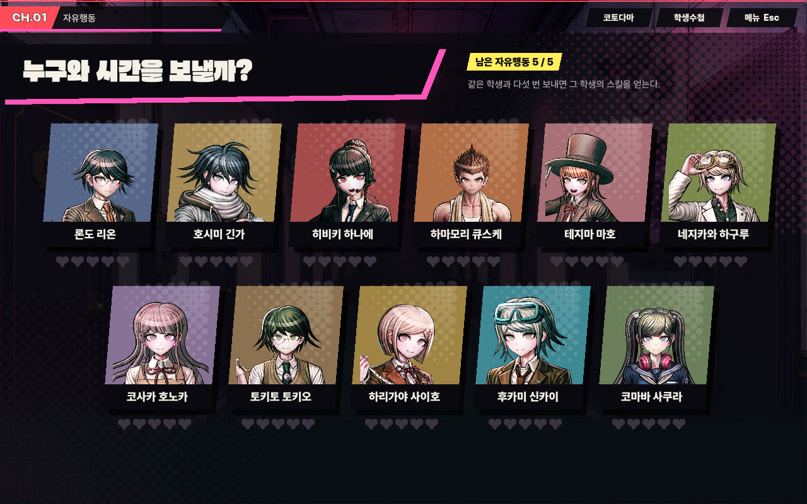
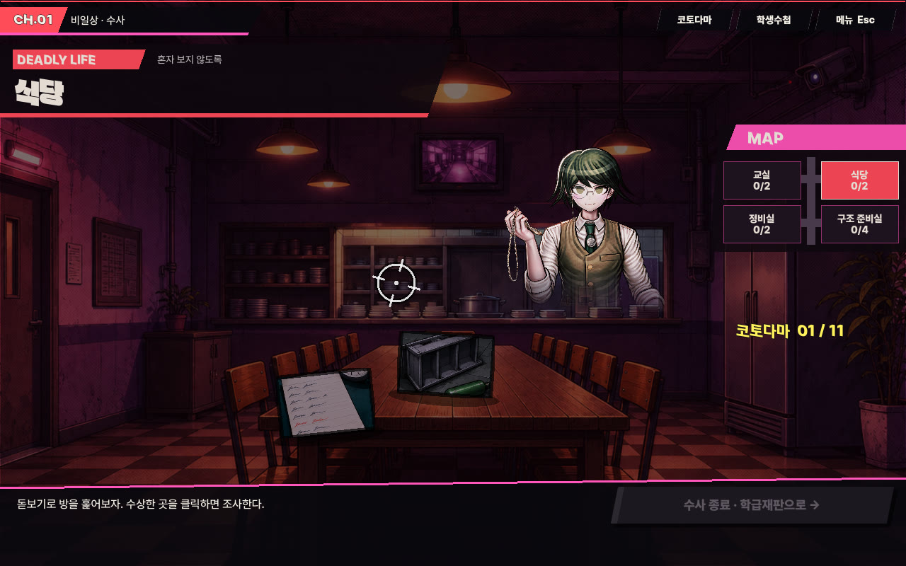
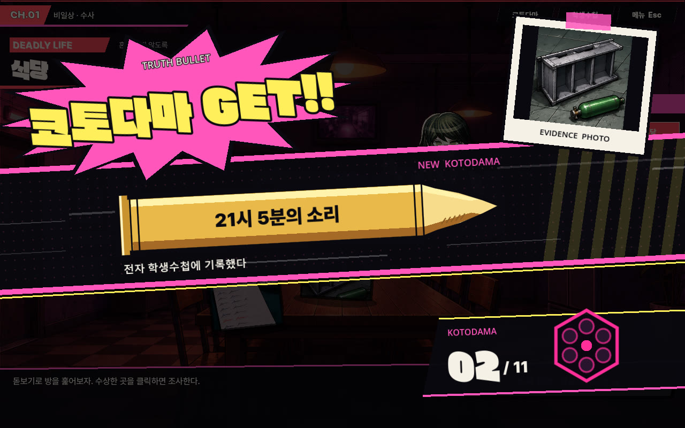
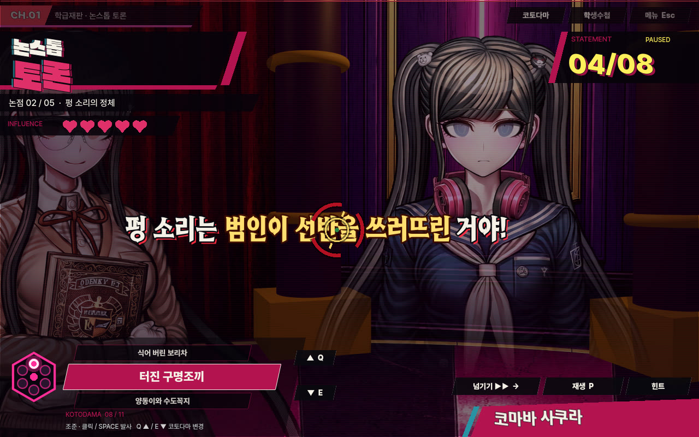
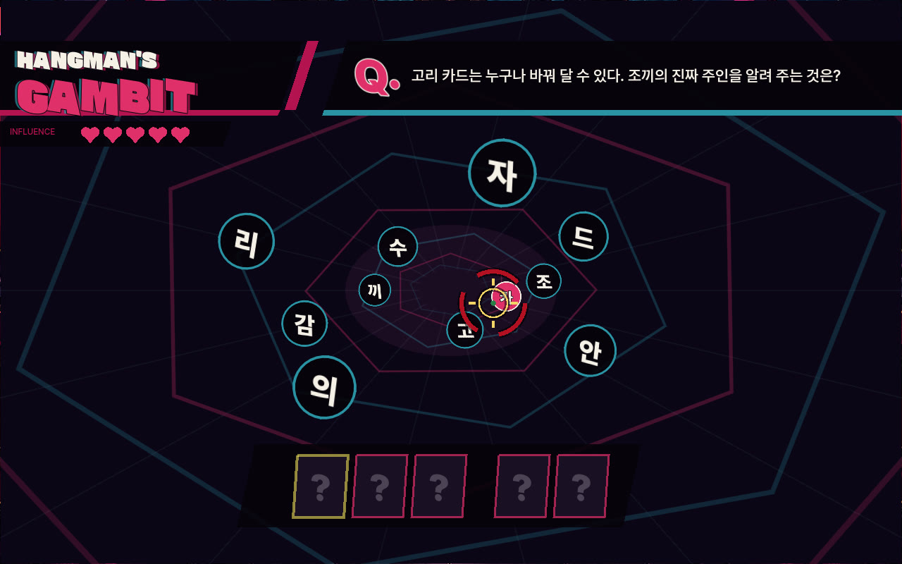
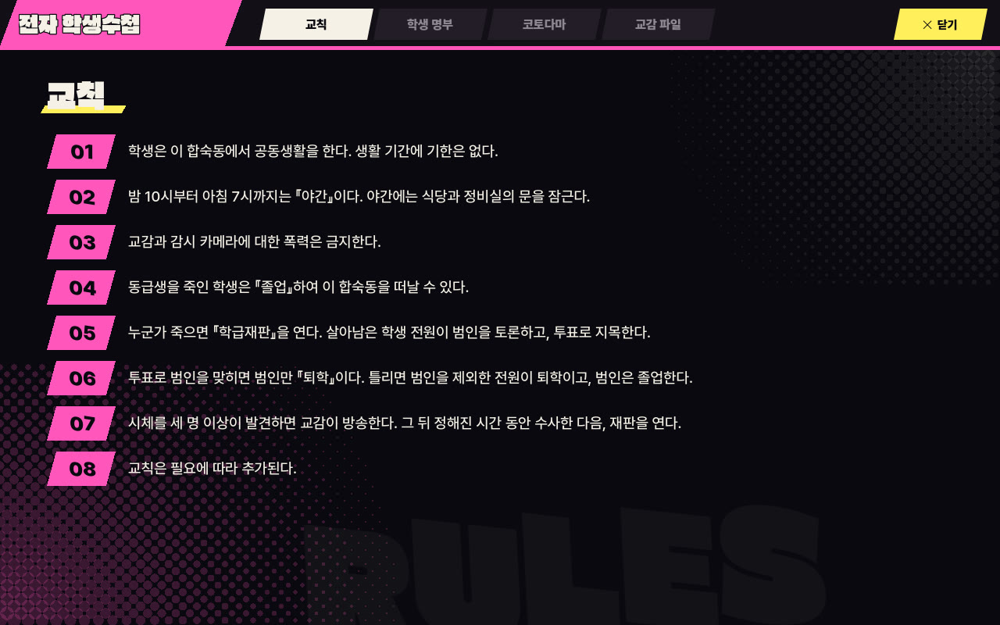

# 단간론파 R: 희망의 합숙동과 절망의 신입생

**DANGANRONPA R** · ダンガンロンパR 希望の合宿棟と絶望の新入生

> 스파이크 춘소프트의 「단간론파」 시리즈에서 영감을 받은 **비공식·비상업 팬게임**입니다. 공식 작품이나 권리자와는 아무 관계가 없습니다. 원작의 이미지·음악·글꼴·로고는 쓰지 않았습니다.

## 다운로드

**[최신 버전 받기 (Windows) →](../../releases/latest)**

릴리스 페이지에서 `DanganronpaR.exe` 하나만 받으면 됩니다. 설치 과정 없이 바로 실행됩니다.

- **필요한 환경**: Windows 10 / 11 (64비트), OpenGL 3.3을 지원하는 그래픽
- **용량**: 약 620MB
- **처음 실행할 때**: 서명이 없는 프로그램이라 Windows가 경고를 띄울 수 있습니다. 「추가 정보」 → 「실행」을 누르면 됩니다.

## 이야기

시즈오카현 산간의 사립 토코요 학원. 입학식 날 건강 검진을 받던 신입 특별과정 열두 명은, 창문 하나 없는 신입생 합숙동의 교실에서 눈을 뜹니다.

모든 시계와 달력은 입학식 다음 날을 가리킵니다. 잠수 헬멧을 쓴 펭 교감은, 동급생을 죽이고 들키지 않으면 이곳을 졸업할 수 있다고 말합니다.

그리고 기록복원가 후미노 츠즈리의 주머니에는, 자기 글씨로 쓴 누렇게 바랜 쪽지가 들어 있습니다.

**「날짜를 믿지 마.」**

## 게임 구성

프롤로그부터 최종장, 그리고 TRUE END까지 끝까지 플레이할 수 있습니다.

| | |
|---|---|
| 분량 | 프롤로그 + 5개 장, 대사 약 8,300줄 |
| 등장인물 | 초고교급 신입생 12명과 펭 교감 |
| 음성 | 학급재판 전체와 펭 교감의 모든 대사 (일본어 음성, 한국어 자막) |
| 음악 | 장면별 15곡 |
| 업적 | 15개 |
| 난이도 | 추리 난이도 쉬움 / 보통 / 어려움 |

### 일상과 자유시간

합숙동의 방을 돌아다니며, 방 안에 서 있는 동급생에게 조준경을 맞춰 말을 겁니다. 방의 물건을 살펴보면 후미노의 생각을 들을 수 있습니다. 자유시간에 같은 학생과 다섯 번을 보내면 그 학생의 숨겨진 이야기를 듣고, 학급재판에서 쓸 수 있는 스킬을 얻습니다.

### 수사

사건이 일어나면 현장을 돋보기로 훑어 증거를 찾습니다. 찾은 증거는 「코토다마」가 되어 전자 학생수첩에 기록됩니다.

### 학급재판

- **논스톱 토론**: 흘러가는 발언 속에서 기록과 어긋나는 약점을 코토다마로 쏩니다. 발언은 말투에 따라 다르게 나타나고 움직입니다. 시간 제한은 없고, 발언이 한 바퀴 돌면 처음부터 다시 들을 수 있습니다.
- **행맨즈 갬빗**: 질문의 답이 되는 말을, 화면 안쪽에서 날아오는 글자를 순서대로 쏴서 완성합니다.
- **반론 쇼다운**: 결론에 맞서는 상대의 주장을 베어 넘기고, 약점을 알맞은 코토다마 칼날로 끊습니다.
- **클라이맥스 추리**: 사건의 전말을 만화 칸에 순서대로 채웁니다.
- **투표**: 재판장 원 한가운데에서 돌아가며 범인을 지목합니다.

### 전자 학생수첩

교칙, 학생 명부, 모은 코토다마, 교감 파일을 언제든 볼 수 있습니다.

## 조작

| 상황 | 조작 |
|---|---|
| 대사 넘기기 | 클릭 / Enter / Space |
| 대사 빨리 넘기기 | SKIP 버튼 또는 Ctrl 누르고 있기 |
| 지난 대사 보기 | LOG 버튼 / L / 마우스 휠 위로 |
| 메뉴 (저장·불러오기·설정) | Esc |
| 논스톱 토론 | 약점 클릭 또는 Space로 발사, Q · E로 코토다마 바꾸기, P로 멈춤, →로 다음 발언 |
| 투표 | ← → 로 돌기, Enter로 투표 |

각 시스템이 처음 나올 때 게임 안에서 설명 카드가 뜹니다.

## 저장

- 진행은 자동으로 저장되고, 메뉴에서 수동 저장 슬롯 6개를 쓸 수 있습니다.
- 저장 파일 위치: `%APPDATA%\Godot\app_userdata\단간론파 R`

## 알아 두실 점

- 살인 사건과 시체가 나오는 추리물입니다. 피는 분홍색으로 표현됩니다.
- 화면의 글은 한국어이고, 음성은 일본어입니다.
- 캐릭터·배경·증거 일러스트와 음성·음악·효과음은 생성형 AI 도구로 만들었습니다(음성·음악·효과음은 ElevenLabs).
- 혼자서 만드는 팬게임이라 오타나 버그가 있을 수 있습니다. 발견하시면 [Issues](../../issues)에 남겨 주세요.

## 사용한 것

- 엔진: [Godot Engine 4.7.2](https://godotengine.org) (MIT)
- 글꼴: Pretendard, Noto Sans KR, Gasoek One, Black Han Sans, Do Hyeon (SIL Open Font License)
- 글꼴: 던파 연단된 칼날 (㈜ 네오플, 네오플 글꼴 라이선스. 수정 없이 배포된 형태 그대로 포함)

라이선스 전문은 [licenses](licenses) 폴더에 있습니다.

## 권리 안내

「단간론파」와 관련 명칭의 권리는 스파이크 춘소프트에 있습니다. 이 게임은 팬이 비영리로 만든 2차 창작물이며, 판매하지 않습니다. 권리자의 요청이 있으면 배포를 중단합니다.
